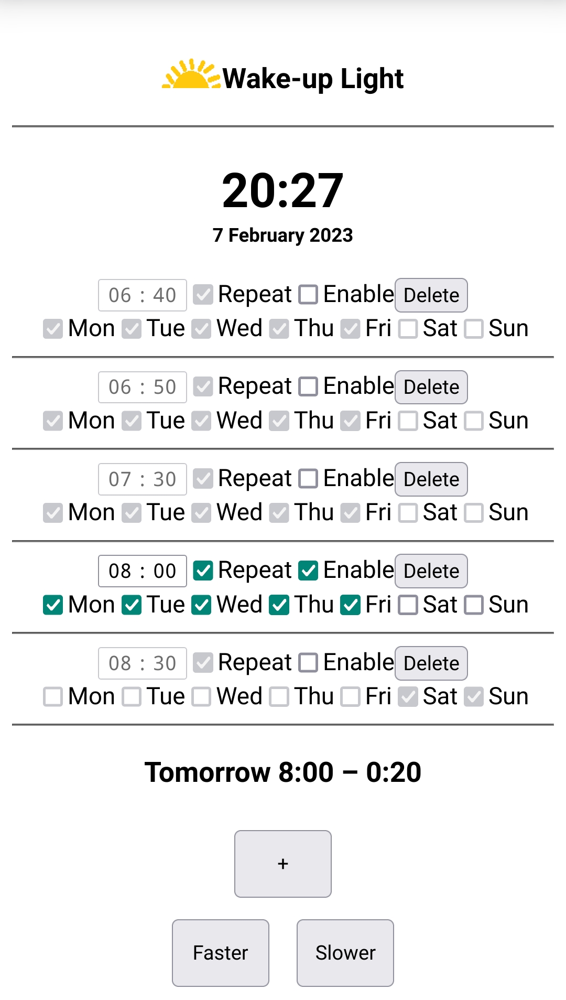

# Wake-up Light

The wake-up light emulates  alarm clocks like Philips' Wake-Up Light.

This is based upon Frans van Buul's [Wake-up Light][Wake-up Light].
I liked that it had a web gui to set alarms, but I wanted a real alarm clock, not the ceiling mounted light.

## Functions
Starting from the light and web ui, these were added:

- The obligatory 7-segment LED display.
- Adaptive intensity for the display
- I also wanted the web interface to have more of the feel of the standard Android alarm clock with multiple alarms.
- Easy Wifi set-up: no hard coded credentials
- Also added was a multi-function button:
    - turn off the alarm when activated
    - cycle through a number of light intensities
    - clear Wifi settings when held down at power-up
- NeoPixel as a light source

## UI

## Hardware
With all the added functionality, the number of exposed IO pins on an ESP-01 is not enough.
I used an Olimex MOD-WIFI-ESP8266, but any ESP-12 variant would probably do.

## Dependencies

- _ArduinoJson_ by Benoit Blanchon
- _NeoPixelBus by Makuna_ by Michael C. Miller (makuna@live.com)
- _Time_ by Michael Margolis
- _TM1637_ by Avishay Orpaz <avishorp@gmail.com>
- _WiFiManager_ by tzapu

[Wake-up Light]: https://www.instructables.com/id/Wake-up-Ceiling-Light/
